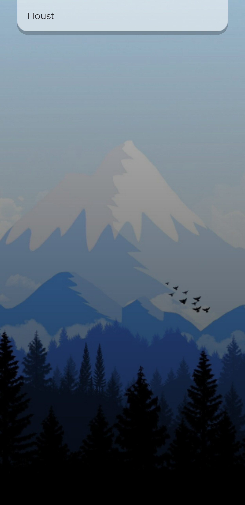

# APP DESCRIPTION
A React based app that allows user to search their location and shows the weather conditions of their location or searched location

### Start Screen
<!--  -->

### Weather Reading of Cape Coast, Ghana
<!--  -->

### Weather Reading of New York, US

### Half Typed Location (Houston, Texas)
